# StudyMate — Call Graph

> Who calls what, where. Every arrow is a real function call; `file:line` refs are to the current
> checkout. Read together with `docs/oral-exam-study-guide.md`.
>
> Legend: solid `-->` = direct call · dashed `-.->` = callback / hook / telemetry · `-->|cond|` =
> conditional branch.

---

## 0. Module-level dependency map

Who imports whom (arrows = "calls into"):

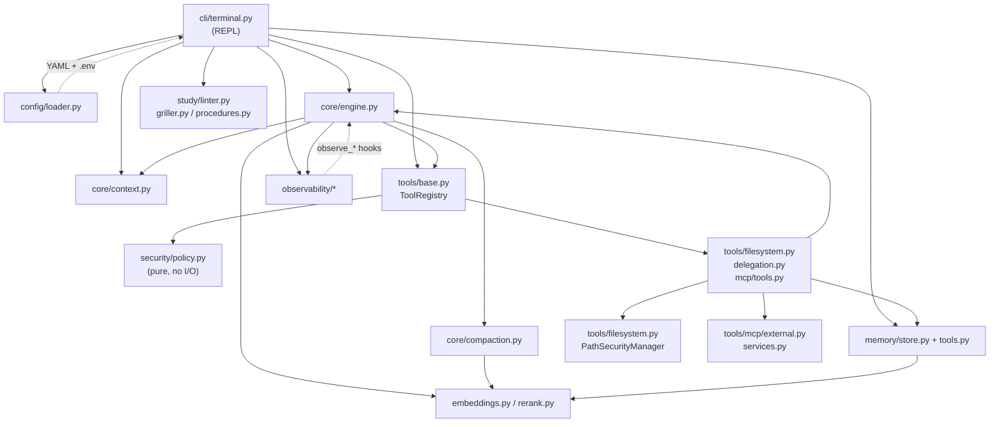

**Key rule:** `security/policy.py` imports nothing from engine/CLI (pure & unit-testable).
`core/engine.py` does **not** import `memory` (persistence is the CLI's job).

---

## 1. Bootstrap — `main()` → `run_cli()`

`study_agent/cli/terminal.py`

```mermaid
flowchart TD
    M["main() <b>terminal.py:1381</b>"] -->|--inline / non-TTY| RC["run_cli() <b>:786</b>"]
    M -->|"LAUNCH_NEW_TERMINAL"| NW["launch_in_new_window() <b>:1341</b><br/>wt.exe / start → re-invoke --inline"]
    NW --> M

    RC --> A1["load_config() <b>loader.py:42</b>"]
    A1 --> A2["_load_env_file() <b>:8</b>"]
    A1 --> A3["yaml.safe_load → AppConfig(**data)"]
    A1 --> A4["os.getenv INNKUBE_API_KEY <b>:55</b>"]

    RC --> B1["OpenAICompatibleLLMClient(cfg.llm) <b>:795</b>"]
    RC --> B2["ContextManager(system_prompt_path) <b>:796</b>"]
    B2 --> B3["_init_system_prompt() <b>context.py:42</b><br/>custom → soul.md → DEFAULT"]
    B2 --> B4["_render_system_message() <b>:31</b><br/>+ Current date + injected note"]

    RC --> C1["init_metrics(True, host, port) <b>:800</b>"]
    C1 --> C2["prometheus start_http_server :8000"]

    RC --> D1["ToolRegistry(policy=policy_from_config(...)) <b>:803</b>"]
    D1 --> D2["policy_from_config() <b>policy.py:137</b><br/>→ PermissionPolicy(rules) or None"]
    RC --> D3["registry.on_permission_decision.append(<br/>_log_permission_event) <b>:834</b>"]
    RC --> D4["registry.confirmation_handler =<br/>make_confirmation_handler() <b>:832</b>"]

    RC --> E1["register_filesystem_tools() <b>:846</b>"]
    E1 --> E2["PathSecurityManager(...) <b>filesystem.py:41</b>"]
    E1 --> E3["register × 8 tools"]
    RC --> E4["register_mcp_tools() <b>:858</b>"]
    E4 --> E5["ExternalMCPService(command, args)"]
    E4 --> E6["ObsidianVaultService(vault_path)"]
    RC --> E7["register_delegation_tools() <b>:878</b>"]
    RC --> E8["HealthHeartbeat.start() <b>:886</b><br/>daemon thread, tick every 60s"]

    RC --> F1["AgentEngine(llm, registry, cfg, compaction) <b>:930</b>"]
    RC --> G1["MemoryStore(cfg.memory.db_path) <b>:942</b>"]
    G1 --> G2["_init_db() store.py:102 → BEGIN + CREATE TABLE"]
    G1 --> G3["load_sqlite_vector() embeddings.py:12"]
    RC --> G4["InnKubeEmbedder / InnKubeReranker <b>:950</b>"]
    RC --> G5["register_memory_tools() <b>:966</b>"]
    RC --> G6["recall_facts('', limit=5) →<br/>context.inject_system_note(facts) <b>:975</b>"]

    RC --> H1["print_banner() + prompt_toolkit session <b>:1010</b>"]
    H1 --> LOOP{"REPL while True <b>:1023</b>"}
```

---

## 2. REPL turn — dispatch table

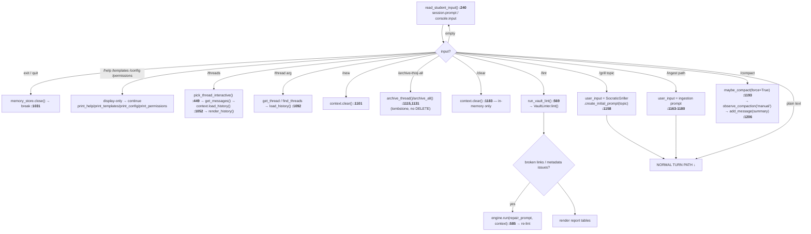

---

## 3. Normal turn — before the engine

`terminal.py:1234-1311`

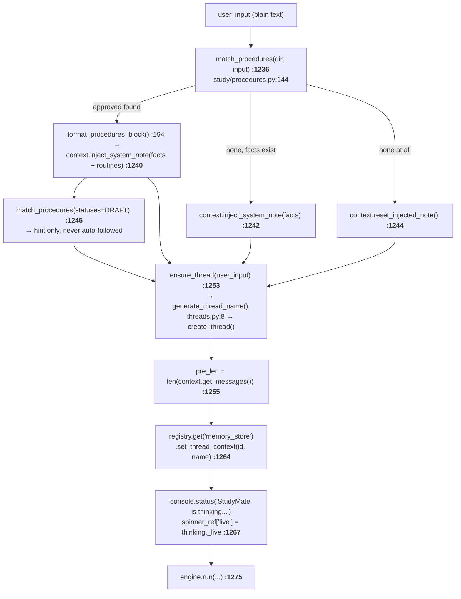

---

## 4. The ReAct loop — `AgentEngine.run()` (`core/engine.py:254-693`)

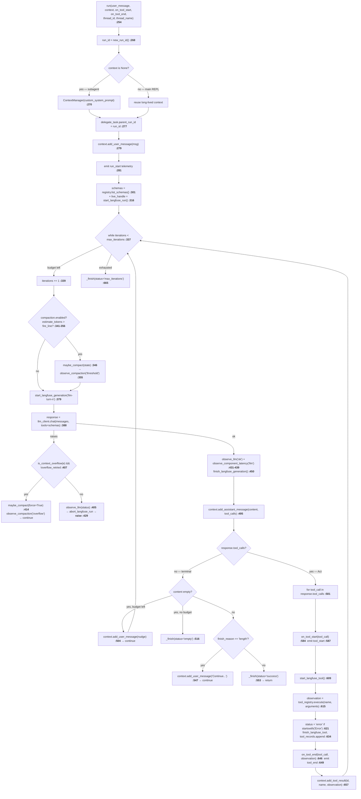

### 4a. `_finish()` — the single exit point (`engine.py:148-236`)

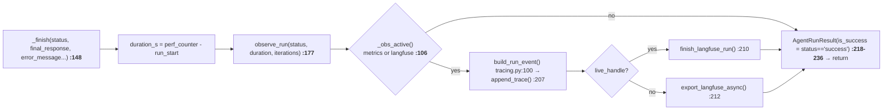

---

## 5. One tool call — registry → policy → jail → tool

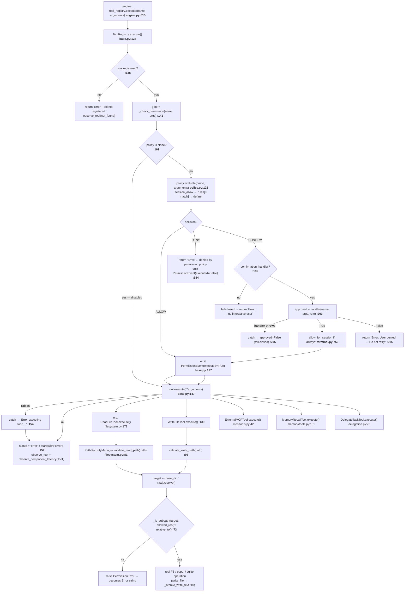

---

## 6. Delegation → child engine

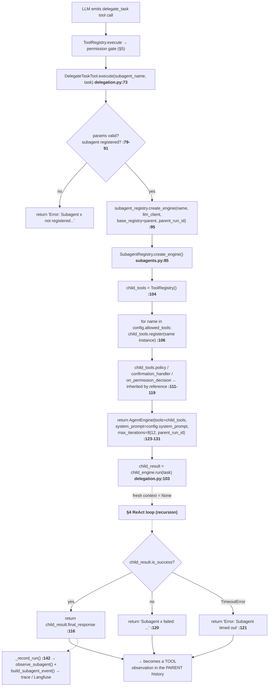

---

## 7. Memory paths

### 7a. Store a fact (LLM-initiated)

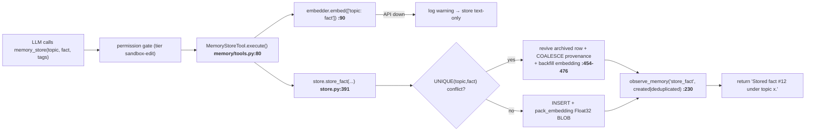

### 7b. Recall (hybrid) — `memory/retrieval.py:39`

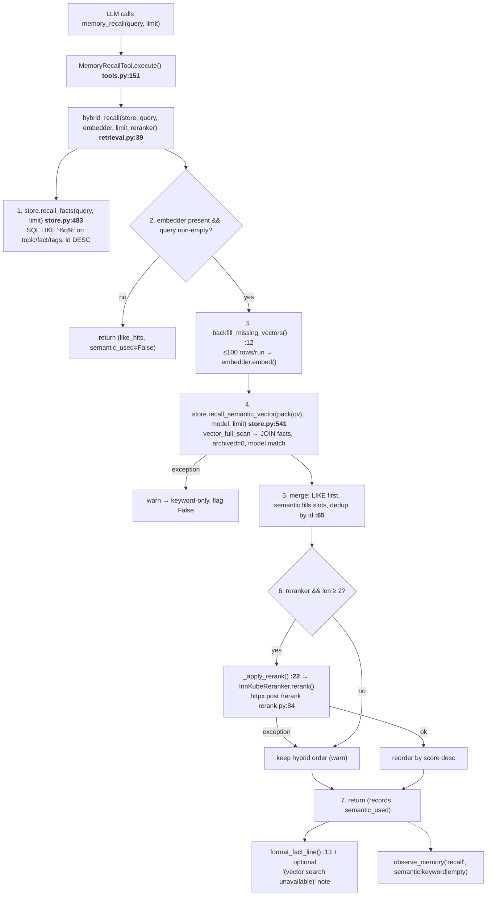

### 7c. Thread persistence & resume (CLI-driven)

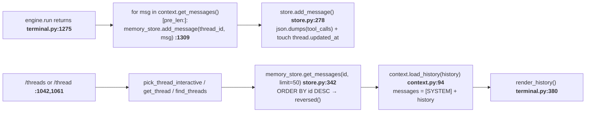

---

## 8. Compaction — three triggers, one algorithm

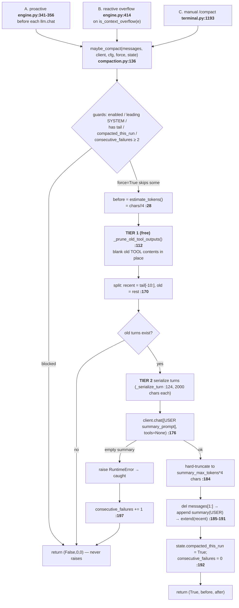

Window resolution used by the threshold: `resolve_context_window()` (`compaction.py:72`) →
**config map → gateway `/model/info` → model-id suffix regex → default 128000**.

---

## 9. Observability fan-out

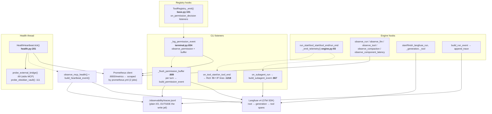

---

## 10. Study-layer flows

### `/lint` with auto-repair

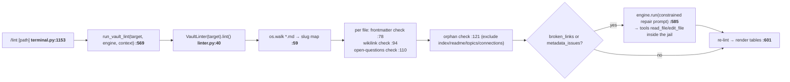

### `/grill` and `/ingest` — prompt rewrites, same engine path

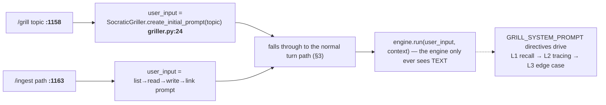

---

## 11. LLM client call — `llm/client.py:104`

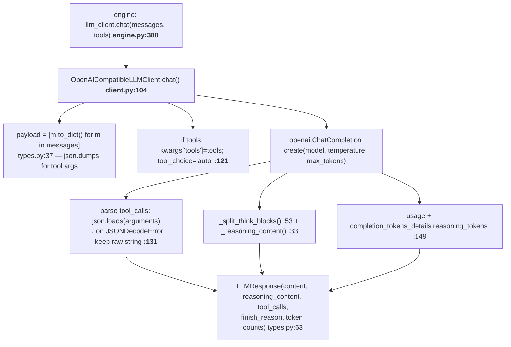

`MockLLMClient.chat()` (`llm/mock.py`) returns the next scripted response from `_current_index`
(incremented per call) — **enqueue exactly as many responses as the loop will make iterations**.

---

## 12. Call index — "where is X defined / who calls it"

| Function | Defined at | Called by |
|---|---|---|
| `main` | `cli/terminal.py:1381` | console script `studymate` |
| `run_cli` | `cli/terminal.py:786` | `main` |
| `load_config` | `config/loader.py:42` | `run_cli:794` |
| `ContextManager._init_system_prompt` | `core/context.py:42` | `ContextManager.__init__`, `clear()` |
| `ContextManager.inject_system_note` | `core/context.py:102` | `run_cli:975,1240,1242` |
| `ContextManager.load_history` | `core/context.py:94` | `/threads`, `/thread` (`:1052,1092`) |
| `AgentEngine.run` | `core/engine.py:254` | `run_cli:1275`, `run_vault_lint:585`, `DelegateTaskTool:103` |
| `AgentEngine._finish` | `core/engine.py:148` | `run` (success/empty/max_iterations exits) |
| `llm_client.chat` | `llm/client.py:104` | `engine.py:388`, `compaction.py:176` |
| `ToolRegistry.execute` | `tools/base.py:128` | `engine.py:615` |
| `ToolRegistry._check_permission` | `tools/base.py:162` | `execute:141` |
| `PermissionPolicy.evaluate` | `security/policy.py:125` | `_check_permission:172` |
| `ConfirmationHandler` (y/n/always) | `cli/terminal.py:708` | `_check_permission:203` |
| `PathSecurityManager.validate_read_path` | `tools/filesystem.py:81` | every read tool, `search_text` walk |
| `PathSecurityManager.validate_write_path` | `tools/filesystem.py:93` | `create_folder/write_file/edit_file/rename_file` |
| `_atomic_write_text` | `tools/filesystem.py:10` | `write_file` |
| `DelegateTaskTool.execute` | `tools/delegation.py:73` | `ToolRegistry.execute` |
| `SubagentRegistry.create_engine` | `core/subagents.py:85` | `DelegateTaskTool.execute:95` |
| `MemoryStore.store_fact` | `memory/store.py:391` | `MemoryStoreTool.execute:94` |
| `hybrid_recall` | `memory/retrieval.py:39` | `MemoryRecallTool.execute:155` |
| `MemoryStore.add_message` | `memory/store.py:278` | `run_cli:1309` (after each run), `:1206` (`/compact`) |
| `maybe_compact` | `core/compaction.py:136` | `engine.py:346,414`, `run_cli:1193` |
| `resolve_context_window` | `core/compaction.py:72` | `engine._window:238`, `print_context_usage` |
| `match_procedures` | `study/procedures.py:144` | `run_cli:1236,1245` |
| `VaultLinter.lint` | `study/linter.py:40` | `run_vault_lint:573` |
| `SocraticGriller.create_initial_prompt` | `study/griller.py:24` | `/grill` handler `:1158` |
| `format_concept_note` | `study/templates.py:66` | agent tool calls / e2e tests |
| `policy_from_config` | `security/policy.py:137` | `run_cli:803` |
| `init_metrics` | `observability/metrics.py:65` | `run_cli:800` |
| `build_run_event` / `append_trace` | `observability/tracing.py:100/158` | `engine._finish:184-207`, CLI error path |
| `observe_permission` / `observe_subagent` | `observability/metrics.py:246/254` | `_log_permission_event`, `_record_run` |
| `HealthHeartbeat.tick` | `observability/health.py:201` | daemon thread `mcp-health-heartbeat` |
| `ExternalMCPService.call_tool` | `tools/mcp/external.py:58` | `ExternalMCPTool.execute:42` |
| `ObsidianVaultService._resolve` | `tools/mcp/services.py:371` | all 9 `obsidian_*` tools + MCP server |

---

*Line numbers verified against the current checkout; re-check after any refactor.*
