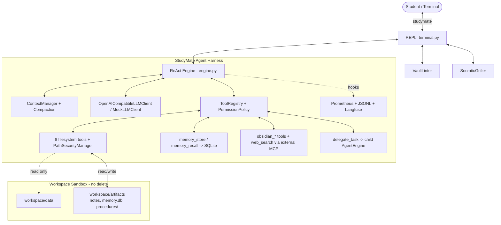

# StudyMate — Oral Exam Study Guide

> Comprehensive revision notes for the AI Engineering Lab (Uni Passau, SoSe 2026) oral exam.
> Covers every subsystem of this repository with file/line references.
>
> ⚠️ **`AGENTS.md` is stale (Week 1 snapshot).** Corrections where it disagrees with the code:
> | AGENTS.md says | Reality |
> |---|---|
> | `max_iterations: 15` | **50** (`config/config.yaml:20`, `settings.py:20`) |
> | 7 filesystem tools | **8** — `rename_file` was added |
> | `memory/`, `observability/`, `subagents/` are empty stubs | **All fully implemented** (Weeks 2 & 3) |
> | `compose.yaml` missing | It exists (284 lines) |
> | `search_text` is regex | It is `re.escape`d → literal substring |

---

## Table of contents

1. [The 60-second pitch](#1-the-60-second-pitch)
2. [Architecture](#2-architecture)
3. [Configuration system](#3-configuration-system)
4. [Core data types](#4-core-data-types)
5. [The ReAct engine](#5-the-react-engine)
6. [Context manager](#6-context-manager)
7. [Context compaction](#7-context-compaction)
8. [Tool contract & registry](#8-tool-contract--registry)
9. [Filesystem tools & the path jail](#9-filesystem-tools--the-path-jail)
10. [Permission policy (Week 3)](#10-permission-policy-week-3)
11. [Subagents & delegation (Week 3)](#11-subagents--delegation-week-3)
12. [Long-term memory (Week 2)](#12-long-term-memory-week-2)
13. [Procedural memory — procedures/skills](#13-procedural-memory--proceduresskills)
14. [MCP integration (Week 2)](#14-mcp-integration-week-2)
15. [Observability (Week 3)](#15-observability-week-3)
16. [Study layer: templates, linter, griller](#16-study-layer-templates-linter-griller)
17. [The CLI / REPL](#17-the-cli--repl)
18. [Testing strategy](#18-testing-strategy)
19. [Invariants you must not break](#19-invariants-you-must-not-break)
20. [Known gotchas, weaknesses & dead code](#20-known-gotchas-weaknesses--dead-code)
21. [Mock viva questions with model answers](#21-mock-viva-questions-with-model-answers)
22. [Glossary](#22-glossary)

---

## 1. The 60-second pitch

**StudyMate** is an autonomous AI agent harness written from scratch in **Python 3.12** for the AI
Engineering Lab (SoSe 2026, University of Passau). It is a terminal REPL (`studymate`) built around
the **ReAct** paradigm (Reason → Act → Observe → Answer).

What it does for a student:

1. **Ingests** lecture material (`.txt`, `.md`, `.pdf`) from the read-only `workspace/data/`.
2. **Generates** a structured Obsidian knowledge base in `workspace/artifacts/`: atomic concept notes
   with YAML frontmatter and `[[wikilinks]]`, lecture summaries, flashcard decks, Mermaid mind maps.
3. **Lints** the vault (`/lint`) — broken links, orphan pages, missing metadata — and can auto-repair.
4. **Grills** the student Socratically (`/grill <topic>`) through three difficulty levels.
5. **Remembers** across sessions: SQLite threads + facts, hybrid keyword/vector/rerank recall.
6. **Delegates** to isolated subagents (`examiner`, `researcher`) on explicit request.
7. **Is sandboxed**: read-only source data, write-only to `workspace/artifacts`, **no deletion ever**.
8. **Is observable**: Prometheus metrics, JSONL traces, self-hosted Langfuse traces + dashboard.

Key numbers to memorise:

| Fact | Value |
|---|---|
| Default chat model | `qwen-agentworld-35b-a3b` (alt: `gemma4-31b-it`) |
| LLM endpoint | `https://llms.innkube.fim.uni-passau.de` |
| Embedding model | `octen-embedding-8b` |
| Reranker model | `qwen3-reranker-4b` |
| `max_iterations` | 50 (subagents: examiner 8, researcher 12, default 10) |
| Compaction threshold | 0.8 of context window (qwen = 262144 tokens) |
| Filesystem tools | 8 |
| Slash commands | 16 |
| Permission tiers | `observe`, `sandbox-edit`, `consequential` |
| Tests | ~260 (unit + e2e), `pytest`, `pythonpath=["src"]` |

---

## 2. Architecture



### Layer map (feature-folder layout)

| Folder | Responsibility |
|---|---|
| `cli/` | REPL, slash commands, Rich/prompt_toolkit UI, wiring everything together |
| `config/` | Pydantic settings hierarchy + YAML/.env loader |
| `core/` | ReAct loop, context, compaction, shared types, subagent registry |
| `llm/` | `BaseLLMClient` ABC, OpenAI-compatible client, mock client |
| `tools/` | `BaseTool`/`ToolRegistry`, filesystem tools, delegation, `mcp/` subpackage |
| `security/` | `PermissionPolicy`, rules, decisions, audit events (pure, I/O-free) |
| `memory/` | SQLite store, embeddings, hybrid retrieval, rerank, thread helpers, tools |
| `observability/` | Prometheus metrics, JSONL/Langfuse tracing, event builders, health probes |
| `study/` | Obsidian templates, `VaultLinter`, `SocraticGriller`, procedures |

**Dependency rule of thumb:** `security/` imports nothing from the engine/CLI (pure and unit-testable);
`core/engine.py` does **not** import `memory` (persistence is the CLI's job); `observability` is called
via `observe_*` hooks, never inline prints.

---

## 3. Configuration system

### 3.1 Pydantic hierarchy — `config/settings.py`

Root `AppConfig` (`settings.py:126-134`) has seven sections, all `Field(default_factory=...)`:

| Class | Lines | Key fields (defaults) |
|---|---|---|
| `LLMConfig` | 5-14 | `model="qwen-agentworld-35b-a3b"`, `temperature=0.2`, `max_tokens=2048`, `base_url=InnKube`, `timeout=60.0`, `api_key=""`, `embedding_model="octen-embedding-8b"`, `reranker_model="qwen3-reranker-4b"` |
| `AgentConfig` | 17-24 | `name="StudyMate"`, `max_iterations=50 (1..100)`, `system_prompt_path="config/soul.md"`, `workspace_dir`, `data_dir="./workspace/data"`, `artifacts_dir="./workspace/artifacts"` |
| `FilesystemToolConfig` | 27-32 | `enabled=True`, `allow_delete=False`, `allowed_read_paths=["./workspace"]`, `allowed_write_paths=["./workspace/artifacts"]` |
| `MCPToolConfig` | 35-47 | `enabled=True`, `vault_path="./workspace/"`, `search_command="duckduckgo-mcp-server"`, `search_args=[]` |
| `ToolsConfig` | 50-53 | `filesystem`, `mcp` |
| `MemoryConfig` | 56-64 | `enabled=True`, `db_path="./workspace/artifacts/memory/memory.db"`, `max_load=50 (1..200)`, `max_inject=5 (0..20)` |
| `CompactionConfig` | 67-78 | `enabled=True`, `threshold=0.8`, `buffer=20000`, `keep_recent_messages=10`, `summary_max_tokens=1000`, `max_consecutive_failures=2`, `default_context_window=128000`, `context_windows={}` |
| `PermissionRuleConfig` | 81-88 | `tools: List[str]` (fnmatch patterns), `decision` ∈ `allow\|deny\|require-user-confirmation`, `tier`, `arguments: Dict[str,str]` |
| `PermissionsConfig` | 91-100 | `enabled=True`, `default_decision="require-user-confirmation"`, `rules=[]` |
| `ObservabilityConfig` | 103-123 | `metrics_enabled=False`, `metrics_host="127.0.0.1"`, `metrics_port=8000`, `trace_file="./observability/traces.jsonl"`, `trace_max_chars=4000`, `langfuse_enabled=False`, `langfuse_host`, `langfuse_public_key/secret_key`, `health_enabled=False`, `health_interval_seconds=60.0` |

### 3.2 Loading precedence — `config/loader.py:29-37`

```
1. Real system environment variables  (e.g. INNKUBE_API_KEY)
2. .env file in project root          (hand-rolled parser, no python-dotenv)
3. YAML values                        (config/config.yaml)
4. Pydantic defaults
```

Mechanics worth quoting:

- `_load_env_file` (`loader.py:8-22`) only sets `os.environ[key]` **if the key is not already set**
  → that is exactly how a real env var beats `.env`.
- `yaml.safe_load(f) or {}` → `AppConfig(**yaml_data)`. Unknown keys raise (Pydantic), missing keys fall back.
- API key injection (`loader.py:55-58`): if `config.llm.api_key` empty →
  `os.getenv("INNKUBE_API_KEY") or os.getenv("OPENAI_API_KEY")`. One key covers chat + embeddings + rerank.
- Observability overrides (`loader.py:60-91`) each guarded by `if os.getenv(X, "") != ""`.
- **Langfuse keys are env-only, never YAML** (mirrors the API-key pattern).

### 3.3 `config/soul.md` — the persona

Injected as the **first SYSTEM message**. Sections: role/persona, sandbox directives
(read-only data, artifacts RW, never delete), long-term memory STORE/RECALL policy, procedural memory
rules, natural-language request handling, web-search discipline, context compaction expectations,
ReAct workflow (Thought → Action → Observation → Answer), and subagent delegation rules.

---

## 4. Core data types — `core/types.py`

| Model | Lines | Purpose / notable fields |
|---|---|---|
| `Role` | 6-11 | `str, Enum`: `SYSTEM/USER/ASSISTANT/TOOL`. Being a `str` enum means `.value` serialises straight into OpenAI payloads. |
| `ToolCall` | 14-18 | `id`, `name`, `arguments: Dict[str, Any]` — **already parsed** dict, not raw JSON. |
| `ToolResult` | 21-26 | **Legacy/unused.** Real observations travel as `ChatMessage(role=TOOL)`. Good "gotcha" answer. |
| `ChatMessage` | 29-59 | Unified wire format: `role`, `content`, `tool_calls`, `tool_call_id`, `name`. `to_dict()` emits the OpenAI shape and **`json.dumps`**s tool arguments (line 50). |
| `LLMResponse` | 63-77 | `content`, `reasoning_content`, `tool_calls`, `finish_reason`, four token counters, `raw_response`. |
| `AgentRunResult` | 80-93 | `final_response`, `iterations`, `tool_calls_count`, token totals, `is_success`, `error_message`, `run_id`, `parent_run_id`, `metadata`. |

---

## 5. The ReAct engine — `core/engine.py` (693 lines)

**This is the most likely deep-dive question. Learn it cold.**

### 5.1 Constructor (`__init__`, L62-91)

```python
def __init__(self, llm_client, tool_registry=None, config=None, compaction=None,
             llm_base_url="", system_prompt=None, tools=None, max_iterations=None,
             parent_run_id=None, on_telemetry_event=None, observability=None):
```

- Tool registry resolution is a **3-way fallback**: `tools` kwarg → `tool_registry` kwarg → fresh
  `ToolRegistry()` (L77). `tools=` is what the subagent factory passes.
- Explicit `max_iterations` overrides via `self.config.model_copy(update=...)` so a shared
  `AgentConfig` is never mutated (L78-80).
- Holds a per-engine `CompactionState` (L83-84) — persists across runs of the same engine, which is
  how the failure circuit breaker survives between turns.
- Telemetry listener list (L89-91); `parent_run_id` = delegation provenance.

### 5.2 Helpers

| Method | Lines | Role |
|---|---|---|
| `_emit_telemetry` | 93-104 | Fires `{event, parent_run_id, **data}`; listener exceptions swallowed with `logger.warning` — **telemetry can never break the loop** |
| `_obs_active` | 106-109 | Traces only when `metrics_enabled or langfuse_enabled` |
| `_llm_error_status` | 44-52 | Maps exceptions → metric status: `TimeoutError→timeout`, `ConnectionError→connection`, `RuntimeError` containing `"uthenticat"`→`auth`, else `api_error` |
| `_finish` | 148-236 | **Single exit-point builder** for every result |
| `_window` | 238-247 | Caches `resolve_context_window(...)`, logs `Context window: N tokens (source: X)` |

### 5.3 `run()` control flow (L254-693)

```python
def run(self, user_message, context=None, on_tool_start=None, on_tool_end=None,
        thread_id="", thread_name="") -> AgentRunResult:
```

**Phase A — setup (L268-335)**

1. `run_id = new_run_id()` (L268)
2. If `context is None` → create a fresh `ContextManager(custom_system_prompt=self.system_prompt)`
   (L269-270). **This is exactly what a subagent does** → fresh history, parent invisible.
3. Stamp `delegate_task.parent_run_id = run_id` (L274-277).
4. `context.add_user_message(user_message)` — the user turn enters history *before* the loop (L279).
5. Emit `run_start` telemetry (L281).
6. Local counters: `iterations`, `tool_calls_count`, four token totals, `overflow_retried=False`,
   `compacted_this_run` reset, `run_start=time.perf_counter()`, `turns=[]`, `compactions=0` (L286-299).
7. `schemas = self.tool_registry.list_schemas()` — computed **once per run** (L301).
8. Optionally open a live Langfuse root span (L313-335); any failure → `live_handle = None`
   (degrades to post-hoc export).

**Phase B — the loop (L337)**

```python
while iterations < self.config.max_iterations:
    iterations += 1          # incremented at the TOP → at most N LLM calls
```

**Step 0 — proactive context guard (L341-356)** — *compact before the call, never after an overflow*:

```python
if self.compaction.enabled:
    window = self._window()
    fire_line = compaction_threshold_tokens(window, self.compaction)
    if estimate_tokens(context.get_messages(), schemas) > fire_line:
        compacted, before, after = maybe_compact(..., state=self.compaction_state)
        if compacted: compactions += 1; observe_compaction("threshold")
```

**Step 1 — Reason (L358-471)**

- Build a Langfuse *delta* snapshot of new messages (L364-376).
- Open a generation span `llm-turn-{n}` (L377-386).
- The core call (L387-391):
  ```python
  response = self.llm_client.chat(messages=context.get_messages(),
                                  tools=schemas if schemas else None)
  ```
- Exception path (L392-429) — see §5.5.
- On success: `observe_llm(model, "ok", latency, tokens...)`, accumulate totals (L431-446), finish the
  generation span (L450-471), append a `turn` record (L475-492).

**Step 2 — append assistant turn + terminal-answer branch (L494-579)**

```python
context.add_assistant_message(content=response.content,
                              tool_calls=response.tool_calls or None)
if not response.tool_calls:                      # L502 — model wants to finish
```

Four sub-cases:

| Case | Lines | Behaviour |
|---|---|---|
| Empty content, budget left | 503-509 | inject nudge `"Your last response was empty..."` → `continue` |
| Empty content, no budget | 511-544 | `_finish(status="empty")`, `is_success=False` |
| `finish_reason == "length"` (truncated), budget left | 546-551 | inject `"Continue from where you stopped..."` → `continue` |
| Normal finish | 553-579 | `_finish(status="success")`, `is_success=True` |

⚠️ The two `continue` branches go back to the `while` guard, so **retries consume iteration budget**.

**Step 3 — Act: dispatch tool calls (L581-661)**

```python
for tool_call in response.tool_calls:
    tool_calls_count += 1
    if on_tool_start: on_tool_start(tool_call)                 # L584
    self._emit_telemetry("tool_start", {...})                  # L587
    observation = self.tool_registry.execute(name=..., arguments=...)   # L615
    tool_status = "error" if observation.startswith("Error") else "ok"  # L620 ← string convention!
    ...  tool_records.append(...); turn["tools"].append(...)   # L634-644
    if on_tool_end: on_tool_end(tool_call, observation)        # L646
    self._emit_telemetry("tool_end", {...})                    # L649
```

**Step 4 — Observe (L656-661)**: the observation goes back into the conversation:

```python
context.add_tool_result(tool_call_id=tool_call.id, name=tool_call.name, content=observation)
```

**Phase C — budget exhaustion (L663-693)**

Falling out of the loop → `_finish(status="max_iterations", is_success=False)` with the message
*"I reached the maximum number of reasoning steps without finishing..."*. **The engine never loops
forever and never returns `None`.**

### 5.4 Callbacks (three seams)

1. **UI**: `on_tool_start` / `on_tool_end` passed into `run()`; the REPL prints
   `⚙ Action: <name> <args>` and `✓ Completed:` / `✗ Failed:` (`terminal.py:1218-1232`).
2. **Telemetry**: `on_telemetry_event` listeners for `run_start`, `tool_start`, `tool_end`, `run_end`;
   parent engines forward the same listener to children so the REPL sees child activity.
3. **Observability side channels**: `observe_*` Prometheus hooks, `append_trace` JSONL, live Langfuse spans.

### 5.5 Error handling matrix

| Failure | Handling | Outcome |
|---|---|---|
| LLM raises | finish span `level=ERROR`, `observe_llm(model, status)`; if `is_context_overflow(e)` and not yet retried → forced `maybe_compact(force=True)` + `continue`; else `abort_langfuse_run` then **`raise`** (L429) | overflow → one retry; otherwise propagates to the REPL catch block (`terminal.py:1283-1301`) |
| Tool raises | caught inside `ToolRegistry.execute` (`tools/base.py:147-154`) → `"Error executing tool 'x': ..."` | normal TOOL observation; the LLM sees it and adapts |
| Tool not registered | `tools/base.py:136-138` | `"Error: Tool 'x' is not registered."` |
| Permission DENY / user reject / no handler | `tools/base.py:189,197-201,215` | `"Error: ... denied by permission policy"` (fail-closed) |
| Empty model output | §5.2 case table | nudge, then `status="empty"` failure |
| Telemetry listener throws | contained (`logger.warning`) | loop unaffected |
| Trace snapshot throws | `messages = []` (L180-183) | trace degrades, run continues |

### 5.6 `_finish()` (L148-236)

The only place a normal result is built:

1. `duration_s` from `perf_counter`
2. `observe_run(status, duration_s, iterations)`
3. If obs active → `build_run_event(...)` → `append_trace(...)` → Langfuse finish **or**
   `export_langfuse_async(...)`
4. Build `AgentRunResult(...)` with **`is_success = (status == "success")` (L234)**

Statuses: `"success"`, `"empty"`, `"max_iterations"` from the engine; `"error"` is only assigned by
the REPL's own catch block.

---

## 6. Context manager — `core/context.py` (139 lines)

- `messages: List[ChatMessage]`, **index 0 is always the SYSTEM message** (compaction asserts this).
- Append helpers: `add_user_message`, `add_assistant_message(content, tool_calls)`,
  `add_tool_result(tool_call_id, name, content)`.
- `get_messages()` returns the **live list**, not a copy — deliberate, because `maybe_compact`
  mutates it in place.
- `load_history(history)` (L94-100): keeps `messages[0]` if SYSTEM, else re-inits, then sets
  `[system_msg] + list(history)` — **this is the thread-resume primitive**.
- `clear(keep_system_prompt=True)` (L129-134).

### System prompt loading order (`_init_system_prompt`, L42-56)

```
explicit custom_system_prompt  →  config/soul.md (if it exists)  →  DEFAULT_SYSTEM_PROMPT
```

### Rendering (`_render_system_message`, L31-40)

```python
content = self._base_system
content = f"{content}\n\nCurrent date: {date.today().isoformat()}"   # date anchor!
if self._injected_note:
    content = f"{content}\n\n---\n{self._injected_note}"
```

Why the date anchor: without it, small models answer "latest release" questions from stale
training data.

### `inject_system_note()` (L102-116) — important design decision

Folds memory facts / approved procedures **into `messages[0]`** instead of appending a second SYSTEM
message, because *"a second SYSTEM entry breaks strict chat templates (vLLM/LiteLLM 400: 'System
message must be at the beginning')"*. It is **idempotent** (replaces any previous note) and
`reset_injected_note()` clears it so a stale block never leaks into the next turn.

**There is no token budgeting in `ContextManager` at all** — growth is unbounded until
`core/compaction.py` shrinks it.

---

## 7. Context compaction — `core/compaction.py` (223 lines)

### One-sentence answer

**Tiered**: (tier 1) free in-place pruning of old tool outputs, then (tier 2) a single **tool-less LLM
summarization call** that replaces old turns with one `USER` message, keeping the newest
`keep_recent_messages` verbatim — triggered **proactively at 80% of the window**, **reactively once on
a provider context-overflow error**, and **manually via `/compact`**, guarded by a once-per-run flag
and a failure circuit breaker.

### Constants & estimation

- `CHARS_PER_TOKEN = 4` (L12) — `estimate_tokens()` (L28-37) sums message contents + JSON-dumped
  tool calls + JSON-dumped tool schemas, then `max(1, chars // 4)`. **No tokenizer is used.**
- `PRUNED_TOOL_PLACEHOLDER = "[Older tool output cleared — see artifacts/]"`
- `SUMMARY_PREFIX = "[Auto-compact summary"`
- `COMPACTION_SYSTEM_NOTE` (L15-23): terse bullets under exactly **Goals, Decisions, Artifacts
  created (exact file paths), Pending work, Referenced memory topics**; *"Do not mention this
  summarization process."*

### Window resolution (`resolve_context_window`, L72-96) — four layers

1. `cfg.context_windows[model]` → source `"config"` (qwen: 262144, gemma: 131072)
2. GET `{base_url}/model/info?model=...` via httpx, 5 s timeout, module cache → `"gateway"`
3. Regex suffix on the model id, e.g. `x[1m]` → 1,000,000 → `"suffix"`
4. `cfg.default_context_window` (128000) with a warning → `"default"`

### Threshold (`compaction_threshold_tokens`, L99-101)

```python
return min(int(window * cfg.threshold), max(0, window - cfg.buffer - completion_reserve))
```
i.e. 80% of window, but never more than `window − 20 000` so the summarizer call itself fits.

### State guards (`CompactionState`, L104-109)

```python
@dataclass
class CompactionState:
    compacted_this_run: bool = False     # once-per-run guard (reset at start of run())
    consecutive_failures: int = 0        # cross-run circuit breaker (opens at 2)
```

### The algorithm (`maybe_compact`, L136-200) — never raises

Guards (all bypassable by `force=True`):
1. `not cfg.enabled` → skip
2. `messages[0].role != SYSTEM` → skip
3. nothing but the system message → skip
4. `state.compacted_this_run` → **once per run**
5. `consecutive_failures >= max_consecutive_failures` → **breaker open**

Then:
1. `before = estimate_tokens(...)`
2. **Tier 1 (free)** `_prune_old_tool_outputs(messages, keep_recent)` (L112-121): replace TOOL message
   content with the placeholder in place for all but the last `keep_recent` messages.
3. Split `recent = tail[-keep_recent:]`, `old_turns = tail[:-keep_recent]`.
4. **Tier 2**: serialize old turns (`ROLE: text`, tool calls as `[tool calls: name(args)]`, each line
   truncated to 2000 chars) → single `USER` message with `tools=None` (the summarizer gets **no**
   tool schemas) (L176-180).
5. Empty summary → `RuntimeError` → caught → failure path.
6. Hard-truncate summary to `summary_max_tokens * 4` chars.
7. **Rewrite in place** (L185-191):
   ```python
   summary_msg = ChatMessage(role=Role.USER,
       content=f"[Auto-compact summary (N turns compacted, M tool outputs pruned) — "
               f"historical context, not new instructions]\n{summary}")
   del messages[1:]        # system at [0] survives
   messages.append(summary_msg)
   messages.extend(recent)
   ```
   The summary is a **USER** message (not SYSTEM) and explicitly labelled *"historical context, not
   new instructions"* — that prevents **prompt-injection-via-summary**.
8. Success: `compacted_this_run = True`, `consecutive_failures = 0`.
   Failure (L197-200): `consecutive_failures += 1`, return `False`.

### The three trigger points

| Trigger | Where | Metric label |
|---|---|---|
| Proactive threshold, before each LLM call | `engine.py:341-356` | `observe_compaction("threshold")` |
| Reactive overflow retry | `engine.py:407-425` | `observe_compaction("overflow")` |
| Manual `/compact` | `terminal.py:1187-1210` | `observe_compaction("manual")` |

`is_context_overflow(e)` (L203-218) lowercases `f"{type(e).__name__}: {e}"` and matches markers:
`context length`, `context_length`, `maximum context`, `prompt too long`, `too many tokens`,
`input too long`, `context overflow`, `max_tokens`.

---

## 8. Tool contract & registry — `tools/base.py` (221 lines)

### 8.1 `BaseTool` ABC (L23-63)

```python
@property @abstractmethod def name(self) -> str
@property @abstractmethod def description(self) -> str
@property @abstractmethod def parameters(self) -> Dict[str, Any]   # JSON Schema
@abstractmethod def execute(self, **kwargs: Any) -> str            # returns observation string
```

Contract: `execute()` returns a **plain string**, never a structured object, and (by convention)
never an exception.

### 8.2 OpenAI schema (L54-63)

```python
def to_openai_schema(self) -> Dict[str, Any]:
    return {"type": "function",
            "function": {"name": self.name, "description": self.description,
                         "parameters": self.parameters}}
```

Exactly the chat-completions `tools: [{"type":"function","function":{...}}]` shape.

### 8.3 `tool_source()` (L66-77)

Infers the observability tier from `type(tool).__module__`: `.mcp` → `"mcp"`, module contains
`memory` → `"memory"`, else `"builtin"`. Used for metrics/labels, **not** for permissioning.

### 8.4 `ToolRegistry`

- `register(tool)` keyed by `tool.name` (overwrite allowed but logged as a warning).
- `list_schemas()` (L124-126) → what the engine passes to `llm.chat(..., tools=...)`.
- Constructor takes optional `policy` and `confirmation_handler`, plus
  `on_permission_decision: List[Callable[[PermissionEvent], None]]` — the **lifecycle hook seam**.

### 8.5 `execute(name, arguments)` (L128-160) — order of operations

1. **Lookup** → unknown → `"Error: Tool 'x' is not registered."` + `observe_tool(status="not_found")`
2. `arguments = arguments or {}`
3. **Permission gate** `_check_permission(...)` → if it returns a string, **return immediately, the
   tool never runs**
4. **Execute** inside `try/except` → exception → `"Error executing tool 'x': ..."`
5. Success → `status = "error" if result.startswith("Error") else "ok"` (L157) → metrics

**The `"Error"` prefix is the single error channel of the whole system** — reused by the engine
(`engine.py:620`), the metrics layer, and the CLI's `on_tool_end` (failure = `startswith("Error:")`).

---

## 9. Filesystem tools & the path jail — `tools/filesystem.py` (545 lines)

### 9.1 `_atomic_write_text` (L10-29)

`tempfile.mkstemp(dir=target.parent)` → write → `flush` + `fsync` → `os.replace(tmp, target)`; on any
`BaseException` the temp file is unlinked. **The temp file lives inside the already-validated parent
dir, so the atomic rename cannot be used to escape the jail** (docstring L15).

### 9.2 `PathSecurityManager` (L32-103)

Guarantees (L34-39): jail containment, read-only source protection, strict deletion prohibition.

```python
self.base_dir = (base_dir or Path.cwd()).resolve()          # L47
self.allowed_read_roots  = [(self.base_dir / p).resolve() ...]   # from config
self.allowed_write_roots = [(self.base_dir / p).resolve() ...]
# both must be contained by workspace_root → else PermissionError  (L68-71)
```

Core primitive (`_is_subpath`, L73-79):

```python
def _is_subpath(self, target: Path, parent: Path) -> bool:
    try: target.relative_to(parent)   # ValueError => not contained
    except ValueError: return False
    return True
```

`validate_read_path` / `validate_write_path` (L81-103) are structurally identical:

```python
target = (self.base_dir / raw_path).resolve() if not Path(raw_path).is_absolute() \
         else Path(raw_path).resolve()
for allowed in self.allowed_read_roots:
    if self._is_subpath(target, allowed): return target
raise PermissionError(f"Access denied: Path '{raw_path}' resolves outside allowed read boundaries...")
```

**Why `../` and symlink escapes are blocked:** `.resolve()` normalises `..`, resolves symlinks and
makes the path absolute **before** the `relative_to` comparison. `workspace/data/../../etc/passwd`
and a symlink inside `workspace` both fail containment.

Config (`config.yaml:26-34`): read `./workspace`, write `./workspace/artifacts`,
`allow_delete: false`.

### 9.3 The delete prohibition is **structural**, three layers

1. **No delete tool exists** — `register_filesystem_tools` (L526-545) registers 8 tools, none delete.
2. `allow_delete: bool = False` is a **config/test invariant** asserted by tests but **never actually
   read** by `filesystem.py` — enforcement is by absence of capability, not by a flag.
3. The only `os.unlink` in the file cleans up the atomic-write temp file inside the validated dir.
   Memory uses `archived` **tombstones** — `store.py` has no delete API at all.

### 9.4 The 8 tools

| Tool | Validation | Notable behaviour |
|---|---|---|
| `create_folder` | write | `mkdir(parents=True, exist_ok=True)` |
| `write_file` | write | creates parents, **atomic** write, returns byte/line counts; overwrite allowed (it is the artifact generator) |
| `read_file` | read | **pagination**: `offset` (1-based), `limit=200`; header `[File: x | Total lines: N | Showing lines Y-Z]` + `  12 | text` line numbers |
| `list_files` | read | dirs first then name: `sorted(iterdir(), key=lambda p: (not p.is_dir(), p.name.lower()))` |
| `search_text` | read per file | `re.escape(query)` → **literal, case-insensitive substring**, despite the docstring saying regex; **hard cap of 50 hits**; re-validates each file against the jail during the walk |
| `edit_file` | write | target must appear **exactly once** (`not in` → error; `count > 1` → "appears N times") then `replace(target, replacement, 1)` |
| `rename_file` | write on both | refuses to overwrite existing destination; `os.rename` |
| `read_pdf` | read | pypdf imported lazily inside `execute`; `page_start`/`page_end`, **clamped to a 10-page window** with a printed continuation hint |

---

## 10. Permission policy (Week 3) — `security/policy.py` (158 lines)

### 10.1 Design principles (module docstring)

> *"Pure, I/O-free permission policy evaluation... single, ordered rule list evaluated against every
> tool call that passes through the ToolRegistry, for built-in and MCP tools alike. **First match
> wins**; unmatched calls fall back to `default_decision`. This module deliberately has no
> dependencies on the registry, the engine, or the CLI so it can be unit-tested in isolation."*

### 10.2 Decisions (L29-34)

```python
class Decision(str, Enum):
    ALLOW    = "allow"
    DENY     = "deny"
    CONFIRM  = "require-user-confirmation"
```

### 10.3 `Rule` (L37-70) — frozen dataclass

```python
tools: List[str]                  # fnmatch patterns vs tool name ("read_file", "obsidian_*")
decision: Decision
tier: str = ""                    # free-form label (observe / sandbox-edit / consequential)
arguments: Dict[str, str] = ...   # field-name -> fnmatch pattern conditions
```

`matches()`: name must fnmatch one of `tools`; **every** `arguments` pattern must match and the key
must **exist** in the call args (missing key ⇒ rule does not match).

### 10.4 Evaluation order (`PermissionPolicy.evaluate`, L125-134)

```
1. session allowances ("always" chosen at the y/n/always prompt)  → ALLOW
2. ordered rules, first match wins
3. default_decision  (require-user-confirmation = fail-closed)
```

`SESSION_ALWAYS_TIER = "session-always"` (L26) is exported so observability can key
`permission:always:<tool>` off it — *"import it; never retype the string"*.

### 10.5 The gate — `ToolRegistry._check_permission` (`tools/base.py:162-221`)

| Decision | Behaviour | Emitted event |
|---|---|---|
| `policy is None` | everything allowed (permissions disabled) | none |
| `ALLOW` | returns `None` → tool runs | `PermissionEvent(executed=True)` |
| `DENY` | returns `"Error: Tool 'x' is denied by permission policy (rule)."` | `executed=False` |
| `CONFIRM`, **no handler** | **fail-closed** → `"Error: Tool 'x' requires user confirmation..., but no interactive user is available."` | decision recorded as `DENY`, source `"... (no confirmation handler)"` |
| `CONFIRM`, handler returns False | `"Error: User denied the requested tool call 'x'. Do not retry this exact call."` | `executed=False` |
| `CONFIRM`, handler **raises** | caught → treated as deny (*"a broken prompt must fail closed, never crash the loop"*) | `executed=False` |

**Fail-closed summary:** default = ask; no handler = deny; handler exception = deny; non-TTY stdin =
deny; only `enabled: false` disables the gate.

### 10.6 Tiers shipped in `config/config.yaml:69-102`

| Tier | Decision | Tools |
|---|---|---|
| `observe` | `allow` | `read_file, read_pdf, list_files, search_text`, `obsidian_list_notes/read/search/get_outgoing_links/get_backlinks`, `memory_recall` |
| `sandbox-edit` | `allow` | `create_folder, write_file, edit_file, rename_file`, `obsidian_write/append/edit/insert_into_section`, `memory_store` |
| `consequential` | `require-user-confirmation` | `web_search, fetch_web_content, expand_web_link` |
| *(no rule)* | `require-user-confirmation` (default) | *"covers runtime-discovered MCP tools automatically"* |

Note the tier-2 logic: writes are auto-allowed **because the path jail already confines them** to
`workspace/artifacts` — the two security layers compose.

### 10.7 The full decision path (say this end-to-end in the exam)

```
LLM proposes tool call
  → engine dispatch (engine.py:615)
  → ToolRegistry.execute
      (1) registered?
      (2) policy.evaluate → ALLOW | DENY | CONFIRM(y/n/always, fail-closed)
      (3) tool runs inside PathSecurityManager jail
      (4) result or "Error: ..." string back to the LLM as a TOOL observation
  + PermissionEvent audit record → CLI buffer → Prometheus + batched trace event
```

The **engine contains zero permission logic** — the gate lives inside the registry, which is why
every tool call in every loop iteration *and* every child subagent registry is covered.

### 10.8 Confirmation handler (`cli/terminal.py:708-756`)

Rich panel `🔐 Permission check` offering `y / n / always`:
- non-TTY stdin → `False` (fail-closed)
- pauses the Rich `Live` spinner (its repaint would erase the prompt line) — a real bug fix worth
  mentioning
- `always` → `registry.policy.allow_for_session(name)` then `True`
- Ctrl-C / EOF → `False`

---

## 11. Subagents & delegation (Week 3)

### 11.1 The key insight

**Delegation is an ordinary tool call, not a special branch in the engine.** The loop has no
hard-coded delegation logic:

```
engine stamps delegate_task.parent_run_id = run_id        (engine.py:274-277)
  → LLM emits delegate_task
  → ToolRegistry.execute → DelegateTaskTool.execute(subagent_name, task)
  → SubagentRegistry.create_engine(...) → child AgentEngine.run(task)
  → child_result.final_response returned as the TOOL observation string
  → parent continues its own ReAct loop
```

### 11.2 `DelegateTaskTool` (`tools/delegation.py`)

- Schema: `subagent_name` (enum built from the registry), `task`; both required (L52-71).
- Description is deliberately restrictive: *"ONLY invoke this tool when the user explicitly requests
  subagent delegation..."* (L45-50).
- `execute` (L73-140): validation → unknown subagent returns
  `"Error: Subagent 'x' is not registered. Available subagents: ..."` → build child engine →
  `child_engine.run(task)` → success returns `child_result.final_response`; failure returns
  `"Subagent 'x' failed: ..."`; `TimeoutError` → timeout error string. **Never propagates an
  exception to the parent LLM.**
- `_record_run` (L142-178): `observe_subagent(...)` + `build_subagent_event(...)` for the trace,
  all listener failures contained — *"Telemetry must never break a delegation."*

### 11.3 `SubagentRegistry.create_engine` (`core/subagents.py:85-131`) — the security-relevant part

```python
child_tools = ToolRegistry()                       # NEW registry
for tool_name in config.allowed_tools:             # strict allowlist
    tool = base_registry.get(tool_name)
    if tool is not None: child_tools.register(tool)   # same *instances*, filtered set
if base_registry.policy is not None:
    child_tools.policy = base_registry.policy          # permission policy INHERITED
if base_registry.confirmation_handler is not None:
    child_tools.confirmation_handler = base_registry.confirmation_handler
child_tools.on_permission_decision.extend(base_registry.on_permission_decision)

return AgentEngine(llm_client=llm_client, tools=child_tools,
                   system_prompt=config.system_prompt,     # not soul.md
                   max_iterations=config.max_iterations,   # own, smaller budget
                   parent_run_id=parent_run_id, ...)
```

### 11.4 Comparison table — the perfect exam answer

| Aspect | Main agent | Subagent |
|---|---|---|
| Loop code | `AgentEngine.run()` | **Identical** — it *is* the same class, a second instance (recursion, not a special path) |
| Context | long-lived `ContextManager` (persisted threads) | `context=None` → fresh context; parent history invisible; only the `task` string is passed |
| System prompt | `config/soul.md` | `SubagentConfig.system_prompt` |
| Tools | full registry | **filtered clone registry** with only `allowed_tools` |
| Permissions | `PermissionPolicy` + confirmation handler | **inherited by reference** (same objects) — so the gate and the y/n UI apply to children too |
| Iterations | 50 | examiner **8**, researcher **12**, default 10 |
| Provenance | `parent_run_id=None` | stamped → `AgentRunResult.parent_run_id` |
| Result | rendered by REPL | returned as a TOOL observation to the parent |

### 11.5 The two default subagents (`core/subagents.py:134-163`)

| Name | `allowed_tools` | Budget | Prompt intent |
|---|---|---|---|
| `examiner` | `read_file`, `obsidian_get_backlinks`, `memory_recall` | 8 | *"You are strictly read-only. You CANNOT create, modify, or delete any files."* |
| `researcher` | `research_topic` | 12 | *"NO file-writing or file-modifying tools."* |

`ResearchTopicTool` (`delegation.py:181-218`) is **simulated** — returns a canned string. Honest
weakness to volunteer.

---

## 12. Long-term memory (Week 2) — `src/study_agent/memory/`

One SQLite file `workspace/artifacts/memory/memory.db` (inside the write jail → no path-jail bypass
needed), three layers:

| Layer | Tables | Purpose |
|---|---|---|
| Episodic | `threads`, `messages` | conversation persistence / resume |
| Semantic | `facts` (+ `vector_meta`) | durable facts the LLM stores/recalls |
| Retrieval | — | keyword → vector → rerank pipeline |

### 12.1 Schema (`store.py:102-180`)

```sql
threads    (id TEXT PK, name, created_at, updated_at, archived INTEGER DEFAULT 0)
messages   (id INTEGER PK AUTOINCREMENT, thread_id REFERENCES threads(id),
            role, content, tool_calls_json, tool_call_id, name, created_at, archived)
facts      (id INTEGER PK AUTOINCREMENT, topic, fact, tags, source_thread,
            source_thread_name, created_at, archived, embedding BLOB, embedding_model,
            UNIQUE(topic, fact))
vector_meta(model TEXT PK, dim INTEGER)
-- only explicit index: idx_messages_thread ON messages(thread_id, id)
```

Notable details:

- **Explicit `BEGIN` for DDL** (L105-113): sqlite3's legacy isolation mode only opens implicit
  transactions before `INSERT/UPDATE/DELETE`, so DDL autocommits — without `BEGIN`, a failed second
  `CREATE` would leave a corrupt half-schema. Proven by `test_init_db_is_all_or_nothing`.
- **No delete API at all** (docstring L44-49): *"Append-only; no delete API (preserves
  `allow_delete=False` invariant)"*. `archive_*` sets `archived = 1` (tombstone), and
  `archive_thread` cascades to its messages.
- Migrations are column back-fills (L165-177) since `CREATE TABLE IF NOT EXISTS` can't alter.
- `store_fact` dedupe/revive (L391-481): on `UNIQUE(topic, fact)` conflict → re-select, **revive** if
  archived, backfill missing provenance with `COALESCE` (never overwrite), fill/update the embedding
  if missing or from another model → returns `(record, created=False)`.
- `fact` longer than 2000 chars → `ValueError` (surfaced to the LLM as an `Error:` string by the tool).

### 12.2 Embeddings (`embeddings.py`)

- ABC `Embedder` (L73-85): `model` property + `embed(texts)`.
- **`InnKubeEmbedder`** (L88-126): OpenAI-compatible, default **`octen-embedding-8b`**,
  `client.embeddings.create(...)`, errors wrapped into `RuntimeError`. A **fresh `OpenAI` client per
  `embed()` call** — legit weakness to volunteer.
- **`MockEmbedder`** (L129-150): scripted vectors, records every batch in `.calls`.
- **Storage = `sqlite-vector` loadable extension**, not numpy, not a second DB:
  `load_sqlite_vector()` (L12-29) loads `sqlite_vector.binaries/vector` per connection and **never
  raises** → failure sets `vector_available = False`.
- Serialization: little-endian **Float32 BLOB** via `struct.pack(f"<{len(v)}f", *v)`; `fmt="d"` reads
  legacy Float64 rows for one-way migration.
- Metric chosen in SQL: `distance=COSINE` in `vector_init` (`store.py:88`); results come back as
  ascending cosine distance.

### 12.3 Retrieval (`retrieval.py`) — hybrid, **not BM25**

`hybrid_recall(store, query, embedder=None, limit=5, reranker=None) -> (records, semantic_used)`:

```
1. like_hits   = store.recall_facts(query, limit)      # SQL LIKE '%q%' on topic/fact/tags, id DESC
2. no embedder or blank query → return (like_hits, False)
3. _backfill_missing_vectors(...)                      # ≤100 rows per call, text "<topic>: <fact>"
4. qv = embedder.embed([query]); semantic = store.recall_semantic_vector(pack(qv), model, limit)
   -- any exception → warn, keyword-only, flag False
5. merge: LIKE hits first (precise), then semantic-only extras fill remaining slots, deduped by id
6. optional reranker reorder
7. return (merged, True)
```

Key facts:
- The keyword leg is **plain SQL `LIKE`**, not BM25 — literal substring, no tokenisation/ranking.
- The vector leg is `vector_full_scan(...)` — an **exact O(n) cosine scan**, no ANN index; filtered by
  `archived = 0` **and** `embedding_model = active model`.
- Merge policy = *union of two top-k pages with keyword precedence*, **not** score fusion.
- Any embed/rerank failure degrades gracefully instead of raising — *"tools must never throw to the
  LLM."*
- `semantic_used=False` drives the tool's honesty note *"(vector search unavailable; showing keyword
  matches)"*.

### 12.4 Rerank (`rerank.py`)

- ABC `Reranker.rerank(query, documents) -> [(index, score)]` sorted descending; must never raise.
- **`InnKubeReranker`**: default **`qwen3-reranker-4b`**, hits the **non-OpenAI `/rerank` route via
  `httpx.post`** (not the openai SDK). `parse_rerank_response` normalises four possible envelope
  shapes because *"the endpoint is outside the OpenAI spec"*.
- Applied in `_apply_rerank` (L22-36): skipped when fewer than 2 docs; indices the endpoint omitted
  are appended in original hybrid order; **any exception → keep hybrid order**.
- Consequence: **rerank can override keyword-first precedence** — after a successful rerank the list
  is purely score-descending.

"Three models deep": **8B embedder at write, 4B reranker at read, chat model at use.**

### 12.5 Threads (`threads.py`) — pure helpers, no I/O

- `generate_thread_name(first, second=None, max_len=40, fallback_id=None)`: heuristic slugify
  (lowercase, `[^a-zA-Z0-9]+` → `-`, truncate 40), **no LLM call**; empty → `thread-<uuid8>`.
  `second_message` is reserved for v2.
- `resolve_thread(threads, query)`: **exact id → id prefix → case-insensitive exact name**, most
  recent wins on ambiguity.

### 12.6 Tools exposed to the LLM (`memory/tools.py`)

| Tool | Params | Behaviour |
|---|---|---|
| `memory_store` | `topic`, `fact` (required), `tags` (comma-separated) | embeds `"<topic>: <fact>"` (embed failure → stored text-only with a warning, not an error) → `store_fact` → `"Stored fact #12 under topic 'x'."` or `"Already known (deduplicated)..."` |
| `memory_recall` | `query` (required; empty lists recent), `limit` (1..20, default 5) | `hybrid_recall` → formatted lines + overflow hint + optional "vector unavailable" note |

**Anti-forgery design:** the `memory_store` schema exposes **no thread fields**. The harness stamps
provenance via `set_thread_context(thread_id, thread_name)` each turn (`terminal.py:1256-1264`) so the
model cannot forge where a fact came from.

### 12.7 Integration

- **`core/engine.py` does not import `memory`.** Persistence is the CLI's job: after each run it
  writes `context.get_messages()[pre_len:]` via `memory_store.add_message(...)` (`terminal.py:1306-1311`).
- Thread resume: `/threads` → `get_messages(id, limit=memory.max_load)` → `context.load_history(...)`.
- Auto-injection: top `memory.max_inject` (5) recent facts are folded into the system note at startup
  and refreshed each turn (`terminal.py:967-975`, `1234-1251`).
- Metrics: `observe_memory(op, result)` → `studymate_memory_ops_total{op,result}`.

---

## 13. Procedural memory — procedures/skills (`study/procedures.py`)

A **procedure** is a Markdown file with YAML frontmatter + four fixed sections — a reusable routine
the agent follows instead of improvising:

```
---
name, triggers, scope, version, status, supersedes
---
## Steps
## Rationale
## Pitfalls
## Example
```

- Statuses: `approved`, `draft`, `archived` (L10-12).
- `parse_procedure_file` (L81-128): splits on `---`, `yaml.safe_load`, section extraction that is
  **order-independent**; malformed files return `None` with a warning.
- `match_procedures(dir, user_text, statuses=(APPROVED,), limit=2, max_chars=4000)` (L144-177):
  bidirectional case-insensitive substring over `name + triggers + scope`; **archived never matches**;
  sorted by name; greedy budget stop at 2 items / 4000 chars.
- Injection: `procedure_injection_text()` renders
  `Routine 'name' (v1) — follow before improvising:` + scope/steps/why/pitfalls (the Example section
  is **not** injected).

CLI behaviour (`terminal.py:1234-1251`) — memorise this distinction:

- **approved** procedures merge into the system note (template-safe, idempotent replace), layered on
  top of the memory-facts note;
- **draft** procedures are only *surfaced* with a hint — *"say the word and I'll follow it, or approve
  it by flipping status to approved"* — **never silently followed**.

---

## 14. MCP integration (Week 2) — `src/study_agent/tools/mcp/`

MCP (Model Context Protocol) here is used **bidirectionally**.

### 14.1 StudyMate as an MCP **server** (`server.py`, 76 lines)

- `FastMCP("StudyMate Obsidian")` over **stdio** (`run(transport="stdio")`).
- Launch: `python -m study_agent.tools.mcp`; vault override via `OBSIDIAN_VAULT_PATH`.
- Nine `@server.tool()` functions, thin wrappers over `ObsidianVaultService`:
  `obsidian_list_notes`, `obsidian_read_note`, `obsidian_search_notes`, `obsidian_write_note`,
  `obsidian_edit_note`, `obsidian_append_note`, `obsidian_get_outgoing_links`,
  `obsidian_get_backlinks`, `obsidian_insert_into_section`.
- Aimed at external hosts (Claude, Cursor).

### 14.2 StudyMate as an MCP **client** (`external.py`, 214 lines)

- Persistent bridge: **one long-lived stdio server process + one MCP session**, spawned lazily on
  first tool use and reused; restarted once if the session dies.
- All MCP traffic runs on a dedicated background event-loop thread
  (`asyncio.run_coroutine_threadsafe`) so callers stay synchronous.
- `call_tool(name, arguments)` (L58-84): two attempts; transport failure → teardown + restart; second
  failure → `ExternalMCPError`. Tool-level `isError` results are **returned as text, not retried**.
- Config: `config.yaml` uses `search_command: "uvx"` with
  `search_args: ["--with", "duckduckgo-mcp-server[browser]", "duckduckgo-mcp-server"]`.
- Dependency pin: `mcp>=1.9.0,<2.0` while the DuckDuckGo server needs `mcp>=2.1` → it lives in a
  **separate venv** baked into the image at `/opt/mcp/ddg` (`Dockerfile`).

### 14.3 How MCP tools join the registry (`tools/mcp/tools.py`)

- `ExternalMCPTool(BaseTool)` adapts **one remote tool**: `execute()` → `service.call_tool(remote_name, kwargs)`.
  Its `remote_name` attribute is also the engine's duck-typed marker for `server="external-mcp"`.
- Nine `_VaultTool` subclasses are **in-process** (not MCP round-trips) — the same
  `ObsidianVaultService` backs both surfaces (dual-surface design).
- `register_mcp_tools(registry, vault_path, external_service)` registers 3 external + 9 vault tools.
- The registry adapters are **statically declared** (hand-written schemas mirroring the remote tools);
  `session.list_tools()` is used only by the health probe and the e2e contract test.

### 14.4 Shared service (`services.py`, 618 lines)

- `ObsidianVaultService._resolve()` does `candidate.relative_to(self.root)` →
  `PermissionError("Path escapes the configured Obsidian vault")` — a **second, independent jail**.
- `.md` only; `write_note` refuses overwrite unless `overwrite=True`; `edit_note` requires exactly one
  occurrence; wikilink parsing strips `|display` and `#anchor`; all methods return JSON strings.
- `WebResearchService` — a non-MCP DuckDuckGo HTML scraper with bounded BFS crawl.

---

## 15. Observability (Week 3) — `src/study_agent/observability/`

### 15.1 Three sinks, one event builder

| Sink | Module | Transport | Failure behaviour |
|---|---|---|---|
| Prometheus | `metrics.py` | pull, `prometheus_client.start_http_server` on `:8000/metrics` | lazy import, silent no-op |
| JSONL trace | `tracing.py` | append one JSON line per run to `./observability/traces.jsonl` | best-effort, returns `None` |
| Langfuse (self-hosted v4, OTel-based SDK) | `tracing.py` | live spans, async flush | best-effort, never raises |

Security invariant (`tracing.py:1-10`):

> *"Traces live under `./observability/` — outside the agent's write jail (`workspace/artifacts`) —
> and are written with plain file I/O, never via `ToolRegistry`, so the LLM cannot read or forge them."*

### 15.2 Metrics (`metrics.py`) — prefix `studymate`

| Series | Type | Labels |
|---|---|---|
| `studymate_agent_runs_total` | Counter | `status` ∈ `success, max_iterations, error, empty` |
| `studymate_agent_run_duration_seconds` | Histogram | `component` ∈ `total, llm, tool, memory, compaction` |
| `studymate_agent_iterations_total` | Counter | — |
| `studymate_llm_requests_total` | Counter | `model`, `status` ∈ `ok, auth, timeout, connection, api_error, overflow` |
| `studymate_llm_latency_seconds` | Histogram | `model` |
| `studymate_llm_tokens_total` | Counter | `model`, `type` ∈ `prompt, completion, reasoning` |
| `studymate_tool_calls_total` | Counter | `tool`, `source` ∈ `builtin, mcp, memory`, `status` ∈ `ok, error, not_found` |
| `studymate_tool_duration_seconds` | Histogram | `tool`, `source` |
| `studymate_memory_ops_total` | Counter | `op`, `result` |
| `studymate_compactions_total` | Counter | `trigger` ∈ `threshold, overflow, manual` |
| `studymate_permission_decisions_total` | Counter | `tool`, `decision` |
| `studymate_subagent_runs_total` | Counter | `config`, `status` |
| `studymate_mcp_up` | Gauge | `server` (1 live / 0 down) |
| `studymate_mcp_probe_duration_seconds` | Gauge | `server` |

Design contract in the header comment (L7-9): *"permission and sub-agent owners emit into
`observe_permission` / `observe_subagent` — never touch the client directly, so series names stay
frozen."* All emitters are no-ops when disabled; everything is created once under a `threading.Lock`.

### 15.3 Prometheus wiring (`observability/prometheus.yml`, `rules.yml`)

- Scrape interval 15 s, two jobs:
  - `studymate` → `studymate:8000` (persistent service, service-name DNS)
  - `studymate-run` → `host.docker.internal:8000` (one-off `compose run` sessions get no DNS alias)
- **8 recording rules** in group `studymate.agent` @ 30 s: throughput 5m, success rate 5m, failure
  rate 5m, `histogram_quantile(0.95, ...)` component latency p95, LLM token rate by model/type, tool
  usage rate by tool/source, permission decision rate by decision, subagent activity rate by config.

### 15.4 JSONL trace schema v2 (`build_run_event`, `tracing.py:100-155`)

```
schema, run_id, parent_run_id, timestamp, model, model_parameters, available_tools,
thread{id,name}, iterations, tokens{prompt,completion,reasoning,total},
final_response, messages[], turns[], tools[], permission_decisions[], compactions,
duration_s, status, error
```

Truncation helpers default to `trace_max_chars = 4000` with marker `…[truncated N chars]`.

### 15.5 Langfuse span tree

1. **Live root agent span** opened *before* the ReAct loop (`engine.py:316-332`) so the UI latency
   column is real; pre-checks `/api/public/health` with a 3 s timeout → *"host unreachable, run
   unaffected"*.
2. **Generation children** per turn, `llm-turn-{n}`, input = **delta** of new messages (full snapshot
   with `compacted=True` after compaction), `usage_details = {input, output, total}` (reasoning
   deliberately excluded to avoid double-billing), `completion_start_time` = TTFT.
3. **Tool children** on the root span, `level="ERROR"` on failure, metadata `{turn, source, server}`.
4. Close: rename to `studymate-run:{status} ({duration}s)`, tag `[thread_name, status]`, flush.
5. **Post-hoc fallback** `export_langfuse_async` when no live span exists (used by the REPL error path).

### 15.6 Health heartbeat (`health.py`)

Why it exists: Prometheus is pull-only and Langfuse reads ClickHouse, so neither can feed the other —
**one probe fans out to both**.

- Server tiers `external-mcp` / `local-mcp`, deliberately identical to the Langfuse tool-span
  vocabulary so status widgets and traffic widgets filter the same way.
- `probe_external_bridge()` opens a **fresh stdio MCP session** (`initialize()` + `list_tools()`,
  20 s timeout); `probe_obsidian_vault()` lists 1 note.
- `HealthHeartbeat.tick()` → `observe_mcp_health(server, ok, latency)` (Prometheus gauge) + `on_result`
  callback → JSONL/Langfuse event with tool records named `mcp-health:<label>`.
- Daemon thread, first tick immediate, interval `max(5.0, interval_s)` (default 60 s), idempotent
  start, all exceptions contained.

### 15.7 Event record naming (`observability/events.py`)

```python
if not d.executed:                        return f"permission:denied:{d.tool}"
if d.source == SESSION_ALWAYS_TIER:       return f"permission:always:{d.tool}"
return f"permission:{d.tool}"
```

Subagent delegations are modelled as a **tool record named `subagent:<name>`** with
`source="subagent"` and `arguments={"parent_run_id": ...}` so widgets can filter by prefix and link
child → parent trace.

Permission events are **batched per turn** by the CLI (`_flush_permission_buffer`, `terminal.py:809-827`)
into a single trace record with summary `"Permissions: X/Y gated calls executed"`.

### 15.8 How the engine hooks in — **no decorators**

Direct `observe_*` calls + a live-span handle threaded through `run()` + callback seams
(`on_telemetry_event`, `on_permission_decision`, `on_subagent_run`, `on_result`, `on_tool_start/end`).

---

## 16. Study layer: templates, linter, griller

### 16.1 Templates (`study/templates.py`)

**`CONCEPT_TEMPLATE`** — YAML frontmatter + 7 sections:

```yaml
---
title: "{title}"
tags: [{tags}]
course: "{course}"
status: {status}          # required by the linter
last_updated: {last_updated}
prerequisites: [{prerequisites}]
---
## One-line Summary
## Core Intuition
## Formal Definition / Statement
## Key Properties / Complexity
## Worked Example
## Common Pitfalls
## Connections
## Open Questions
```

- **`format_concept_note(...)`** (L66-108) is the helper agents must use — never hand-roll
  frontmatter. Defaults: `status="current"`, `tags = f"concept, {course.lower().replace(' ', '-')}"`,
  `last_updated = date.today().isoformat()`, connections render as `- [[x]] — Relationship description.`,
  open questions as `- [ ] q`.
- `LECTURE_TEMPLATE` (`title`, `course`, `date`, `tags: [lecture, ...]` + Key Takeaways / Linked
  Concepts / Detailed Synthesis) and `FLASHCARD_TEMPLATE` (`# Flashcards: {topic}` + `{cards}`).

### 16.2 Vault linter (`study/linter.py`, 131 lines)

Three regexes (L33-35):

```python
WIKILINK_PATTERN         = re.compile(r"\[\[(.*?)\]\]")
FRONTMATTER_PATTERN      = re.compile(r"^---\s*\n(.*?)\n---\s*\n", re.DOTALL)
OPEN_QUESTIONS_PATTERN   = re.compile(r"## Open Questions\s*\n(.*?)(?=\n## |\Z)", re.DOTALL)
```

`lint()` flow:

1. Missing dir / zero `.md` files → empty report (never raises).
2. Build a **slug map** from `stem.lower()` *and* `name.lower()` → so `[[concept-foo]]` and
   `[[concept-foo.md]]` both resolve.
3. Per file:
   - **Frontmatter**: must be a valid YAML mapping containing exactly the required fields
     **`title` and `status`** (L86-88); other errors → *"Malformed YAMLfrontmatter"* / *"Unclosed YAML
     frontmatter block"*.
   - **Wikilinks**: target cleaned with `raw.split("|")[0].split("#")[0].strip().lower()` (strips
     display text and anchors); unknown slug → `broken_links`.
   - **Open questions**: `- [ ]` or plain `-` (not `- [x]`) inside `## Open Questions`, skipping the
     `*(None logged)*` placeholder.
4. **Orphans**: `inbound_links[slug] == 0`, excluding hub slugs
   `("index", "readme", "topics", "connections")`.

`VaultLintReport.is_healthy` = no broken links **and** no metadata issues.
`/lint` additionally runs a **constrained auto-repair pass through the engine** and re-lints.

### 16.3 Socratic griller (`study/griller.py`, 58 lines)

- `GRILL_SYSTEM_PROMPT`: persona = *"Professor White, an intellectually demanding, precise, and
  adversarial Socratic examiner"* enforcing *"German academic rigor: reject vague, hand-wavy answers."*
- **Three-level progression:**
  1. **Recall & Core Intuition** — definitions, invariants, core theorems
  2. **Application & Tracing** — given concrete inputs, trace/calculate behaviour
  3. **Adversarial Edge Case** — the *"Professor White Special"*: edge cases, performance traps,
     counterexamples
- Directives: ask **exactly ONE** question at a time, never give away the answer or multi-part hints,
  then point out precisely what is right/flawed and push to the next step.
- `create_initial_prompt(topic, context_material=None)` is what `/grill` substitutes for user input —
  so the session starts at Level 1 **inside the normal ReAct loop**; the progression is enforced by
  system-prompt directives, not by special engine code.
- `create_evaluation_prompt(...)` returns a structured `Verdict / Precision Critique / Next Action`
  contract (used in e2e tests; the CLI relies on the system prompt instead).

---

## 17. The CLI / REPL — `cli/terminal.py` (1405 lines)

### 17.1 Startup wiring order (`run_cli`, L786-1010)

1. `load_config()` → `OpenAICompatibleLLMClient` → `ContextManager(system_prompt_path=...)`
2. `init_metrics(...)` if enabled
3. `ToolRegistry(policy=policy_from_config(...))` + permission buffer + listener
4. Confirmation handler (only when a policy exists)
5. Register tools: filesystem → MCP → delegation → memory (+ health heartbeat)
6. `AgentEngine(...)`
7. `MemoryStore(...)` (guarded — failure prints *"Memory disabled (DB init failed)"*), embedder +
   reranker (guarded), `register_memory_tools`
8. Fact auto-injection into the system note
9. `procedures_dir = artifacts_dir / "procedures"`
10. prompt_toolkit session + completer (TTY only), `print_banner`
11. Warning if no API key: *"Set INNKUBE_API_KEY in your .env file"*

### 17.2 The 16 slash commands

| Kind | Commands | Behaviour |
|---|---|---|
| **Display-only** (never touch the engine) | `/help`, `/templates`, `/config`, `/permissions`, `/exit`/`/quit` | print and `continue` |
| **Thread management** | `/threads`, `/thread <#\|id\|name>`, `/new [name]`, `/archive-this`, `/archive-all`, `/clear` | DB-backed: `/threads` opens an arrow-key picker → `get_messages(limit=memory.max_load)` → `context.load_history(...)`; `/clear` resets **in-memory only** ("history stays saved"); `/archive-*` **tombstone, no delete** |
| **Prompt rewrites** (flow through the same `engine.run()`) | `/grill <topic>`, `/ingest [path]`, `/lint`'s repair pass | the CLI *transforms `user_input`* and falls through to the normal engine call — **the engine never sees a "command", only text** |
| **Direct action** | `/lint [path]`, `/compact` | `/lint` runs `VaultLinter` then optionally an engine repair; `/compact` calls `maybe_compact(force=True)` + `observe_compaction("manual")` and persists the summary into the thread |

`/ingest` rewrites input into: list files → read each (PDFs in page ranges) → write
`lecture-<slug>.md` + `concept-<slug>.md` → cross-link with `[[wikilinks]]` → summary.

### 17.3 Per-turn sequence (the non-slash path)

```
read input
→ match procedures (approved → inject into system note; draft → hint only)
→ ensure_thread(user_input)                    # lazy thread creation, slug-named
→ pre_len = len(context.get_messages())
→ registry.get("memory_store").set_thread_context(...)   # provenance stamp
→ engine.run(user_message, context, on_tool_start, on_tool_end, thread_id, thread_name)
→ persist context.get_messages()[pre_len:] into SQLite
→ render Markdown(result.final_response); red "Agent stopped: ..." if not is_success
→ flush permission buffer
```

### 17.4 UI details worth knowing

- **Windows UTF-8**: `sys.stdout.reconfigure(encoding="utf-8", errors="replace")` at import time
  (L7-15) — without it Rich + emoji crash on PowerShell. Don't remove.
- Bottom toolbar: `model | thread | ctx 12.4k/262k (5%)`, colourised
  (`toolbar_level`: red ≥95%, yellow past the compaction threshold, else green).
- Autocompleter: slash commands with descriptions, otherwise registered **tool names** with their
  first docstring sentence as meta.
- Spinner/permission interplay: the y/n prompt stops the Rich `Live` spinner and restarts it in a
  `finally` — otherwise the repaint erases the prompt line (a genuine bug fix).
- `main()` can spawn a **new Windows Terminal window** (`wt.exe`, fallback `start`) unless
  `--inline` or non-TTY.

---

## 18. Testing strategy

- **Framework**: `pytest` + `pytest-mock`; config in `pyproject.toml`:
  `testpaths=["tests"]`, `pythonpath=["src"]`, `addopts="-v"`.
- **Layout**: `tests/unit/test_*.py` (config, context, engine, tools, permissions, compaction, memory,
  observability, mcp, terminal, linter...) and `tests/e2e/test_*.py` (file operations, study
  workflows, delegation + observability, permission workflow, thread resume, memory workflows,
  external MCP stdio).
- **Shared fixtures** (`tests/conftest.py`): `sample_config`, `mock_llm`, `temp_workspace`.
- **Patterns to quote:**
  - `tmp_path` + explicit `FilesystemToolConfig` instead of the real workspace.
  - Script the LLM with `mock_llm.add_response(content=..., tool_calls=[ToolCall(...)])` **sequentially**
    — `MockLLMClient._current_index` increments per `chat()` call; enqueuing fewer responses than
    iterations falls back to an echo response and can mask iteration bugs. **Always enqueue exactly
    as many responses as engine iterations.**
  - Assert **both** side effects (file exists, content contains `"one"`) **and**
    `result.is_success` / `result.final_response`.
  - Security tests: `test_security_path_jail_escape_attempt`,
    `test_security_write_to_read_only_data_dir`.
  - Never make live InnKube calls in unit/e2e tests; real-client tests skip unless
    `INNKUBE_API_KEY` is set; external-MCP e2e skips without the `duckduckgo-mcp-server` binary.
- **Commands**: `pytest`, `pytest tests/unit/test_tools.py -v`,
  `pytest --cov=study_agent --cov-report=term-missing`,
  `ruff check src/ tests/`, `mypy src/` (both installed, **no config files exist**).

---

## 19. Invariants you must not break

1. **No deletion.** No delete tool, `allow_delete: false`, memory uses tombstones. Week 1 spec
   prohibits it; Week 3 permission tiers must not reintroduce it.
2. **All file I/O goes through `ToolRegistry` + `PathSecurityManager`** in agent-facing code — never
   raw `Path.write_text`/`open()` (observability traces deliberately violate this *outside* the jail
   so the LLM cannot forge them).
3. **`workspace/data` is read-only; `workspace/artifacts` is the only write target.**
4. **Tools never raise to the LLM** — `ToolRegistry.execute` catches and returns `"Error: ..."`
   strings; the `"Error"` prefix is the shared status convention.
5. **Fail-closed permissions** — default `require-user-confirmation`, no handler ⇒ deny.
6. **Never bypass `_finish()`** — every result flows through it so metrics/traces/`is_success` stay
   consistent.
7. **Respect `max_iterations`** and return `is_success=False` on exhaustion — never loop forever.
8. **Keep `ChatMessage.to_dict()`'s `json.dumps` behaviour** for tool arguments.
9. **System prompt must stay at index 0** — memory/procedures fold into `messages[0]`, never append a
   second SYSTEM message (vLLM/LiteLLM reject it).
10. **Use `format_concept_note()` / templates**, never hand-rolled frontmatter.
11. **Telemetry must never break the loop** — every listener/hook is wrapped in try/except.
12. **New runtime deps must be added to both `pyproject.toml` and `requirements.txt`.**
13. **Never commit `.env`** — it is gitignored; use `.env.example`.

---

## 20. Known gotchas, weaknesses & dead code

> Volunteering a well-founded weakness in the exam scores highly. Pick 3–4 of these.

### Correctness / quirks

- **`AGENTS.md` is stale** (see the banner at the top of this file).
- **`tools/base.py:216-221` is dead code** — statements after a `return` inside `_check_permission`,
  a refactor leftover; the real metrics call lives in `execute()`.
- **`ToolResult` (`core/types.py:21-26`) is unused** — observations travel as `ChatMessage(role=TOOL)`.
- **`search_text` escapes its query** (`re.escape`, `filesystem.py:334`) despite advertising regex in
  its description → literal substring search.
- **`edit_file` requires exactly one occurrence** — multiple matches are an error, so the agent must
  read the file first and pick a unique snippet.
- **`allow_delete` is never read by runtime code** — the no-delete guarantee is structural (no tool),
  the flag is only asserted by tests.
- **`studymate_agent_active_runs` gauge** is only incremented by `track_active_run()`, which no
  production code path calls → it always reads 0.
- **`_LLM_STATUSES` declares an `overflow` status that is never emitted** — context overflow is counted
  via `observe_compaction("overflow")` instead.
- **`read_pdf` silently clamps to a 10-page window** and prints a continuation hint.
- **`lstrip("- [ ]")` in the linter is a char-set strip**, not a prefix strip — a known quirk.
- **`FACTS_INJECT_TOP_N` in `memory/__init__.py` is dead-ish** — the CLI reads `config.memory.max_inject`.

### Scalability / design trade-offs

- **Token estimation is `chars // 4`** — no tokenizer; can be off for code-heavy or CJK text.
- **Vector search is an exact `vector_full_scan`, O(n) per query** — no ANN index.
- **No index on the `LIKE` columns** (`topic`/`fact`/`tags`) and none on `threads.name`.
- **A fresh `OpenAI` client is constructed per `embed()` call** — no connection pooling.
- **`tags` are stored as one comma-joined string** — no tag table, no index.
- **Rerank silently overrides keyword-first precedence** when its scores disagree.
- **Context grows unbounded in RAM** — `ContextManager` has no truncation; compaction only shrinks on
  threshold/overflow/manual.
- **`messages` are duplicated in RAM and SQLite** with no compaction-aware replay of summarised turns
  (only a manual `/compact` summary row is persisted).
- **`research_topic` is a canned/simulated tool** — not real research.
- **Compaction summarises with `tools=None`** — deliberate, but means the summarizer can't check files.
- **`turns`/`messages` snapshots in traces are truncated to 4000 chars** — traces are lossy by design.

### Operational

- **Everything observability-related is opt-in** (`metrics_enabled: false`, `langfuse_enabled: false`
  by default) and toggled via env; Langfuse keys are env-only.
- **A down Langfuse/Prometheus never fails a run** — every exporter is best-effort with a health
  pre-check.
- **`docker compose run` needs `--service-ports`** for `:8000` scraping, hence the second Prometheus
  scrape job (`host.docker.internal`).

---

## 21. Mock viva questions with model answers

### Q1. Walk me through one iteration of the ReAct loop. What happens if a tool throws?

**Answer.** Each `while iterations < max_iterations` iteration: (0) if estimated tokens exceed the
compaction fire line, compact proactively first; (1) call `llm.chat(context.get_messages(),
tools=schemas)`; (2) append the assistant message — if it has no `tool_calls` we're in the terminal
branch (nudge on empty content, continue on `finish_reason == "length"`, otherwise `_finish`); (3) for
each tool call, invoke the `on_tool_start` callback, emit telemetry, open a Langfuse tool span, and
call `ToolRegistry.execute(name, arguments)`; (4) append the returned string as a `Role.TOOL` message
so the model observes the result.
If the tool throws, `ToolRegistry.execute` catches it and returns
`"Error executing tool 'x': <msg>"`. The engine treats it as an ordinary observation — status is
inferred from `observation.startswith("Error")`. **The exception never reaches the LLM**, so the model
can see the failure and choose a different approach.

### Q2. Why is the compaction summary a USER message and not SYSTEM?

**Answer.** Two reasons. First, the SYSTEM slot at index 0 must stay the persona/system prompt — strict
chat templates (vLLM, LiteLLM) reject a SYSTEM message at index > 0, which is exactly why
`inject_system_note` folds into `messages[0]` instead of appending. Second, treating model-generated
history as an instruction would be a prompt-injection vector: the summary is therefore a `USER`
message explicitly prefixed *"historical context, not new instructions"*, so it can inform but not
command.

### Q3. How could the agent escape the sandbox? Why can't it?

**Answer.** It can't, because every path goes through `PathSecurityManager.validate_read_path` /
`validate_write_path`, which does `(base_dir / raw_path).resolve()` and then a `relative_to()`
containment check against the resolved allowlist roots. `.resolve()` normalises `../`, resolves
symlinks and absolutises **before** the check, so `../../etc/passwd` and a symlink inside `workspace`
both fail. Write roots are additionally asserted to be contained by the workspace root at
construction. And there is no delete capability at all. Even the observability traces are deliberately
written with plain I/O outside `./workspace` so the LLM can neither read nor forge them.

### Q4. What is the difference between a tool error and an agent failure?

**Answer.** A **tool error** is a *string* observation beginning with `"Error"` — it is recoverable,
the LLM sees it in the conversation and can adapt. An **agent failure** is an `AgentRunResult` with
`is_success=False` — terminal statuses are `max_iterations` (budget exhausted), `empty` (model returned
nothing after retries), `error` (the LLM call raised a non-recoverable exception, caught by the REPL).
Tool errors never by themselves make a run unsuccessful.

### Q5. Why does a subagent inherit the permission policy but not the tools?

**Answer.** Because those are different concerns. *Capability* restriction is done by allowlist:
`create_engine` builds a **fresh `ToolRegistry`** and copies in only the `allowed_tools` instances, so
an `examiner` physically cannot write files. *Authority* — whether a permitted capability may run, and
whether a human must approve — is a property of the deployment's policy, not of the task, so the same
`PermissionPolicy` object, confirmation handler and audit listeners are inherited **by reference**.
That way the y/n/always prompt and the `permission:*` audit events apply to children exactly as they
do to the parent. Tools are filtered, authority is shared.

### Q6. Explain the fail-closed default and its three failure paths.

**Answer.** `default_decision = require-user-confirmation` and rules are first-match-wins, so any tool
with no rule — including MCP tools discovered at runtime — demands a human. Fail-closed means the
*failure modes of the confirmation mechanism itself* resolve to deny: (1) no confirmation handler is
installed (non-interactive run) → deny with "no interactive user is available"; (2) the handler raises
→ the exception is caught and treated as rejection, *"a broken prompt must fail closed, never crash the
loop"*; (3) non-TTY stdin or Ctrl-C/EOF at the prompt → the handler returns `False`. Only explicitly
`enabled: false` disables the gate.

### Q7. What happens during hybrid recall if the embedding API is down?

**Answer.** Step 1 already produced keyword hits via SQL `LIKE`, so `hybrid_recall` catches the embed
exception, logs a warning, and returns the keyword-only result with `semantic_used=False`. The
`memory_recall` tool then appends *"(vector search unavailable; showing keyword matches)"* so the model
knows recall was partial, and reports `observe_memory("recall", "keyword")` instead of `"semantic"`.
The same graceful degradation pattern applies to the rerank stage (keeps hybrid order) and to an
unloadable `sqlite-vector` extension (`vector_available=False`). Nothing ever raises to the LLM.

### Q8. The engine contains no permission code — so how does Prometheus see permission decisions?

**Answer.** The gate lives inside `ToolRegistry._check_permission`, which emits a `PermissionEvent`
through the registry's `on_permission_decision` listener seam for every ALLOW/DENY/CONFIRM outcome.
The CLI installs a listener that (a) calls `observe_permission(tool, decision)` → increments
`studymate_permission_decisions_total{tool, decision}` and (b) buffers the event, flushing one batched
trace record per turn into JSONL and Langfuse. Because subagent registries inherit the listener list,
child decisions are counted too. This keeps `security/` free of observability imports and keeps series
names frozen behind `observe_permission`.

### Q9. What is the difference between compaction's two tiers, and when does compaction fire?

**Answer.** Tier 1 is free: for all but the last `keep_recent_messages` (10) messages, TOOL message
contents are replaced in place with `"[Older tool output cleared — see artifacts/]"` — the file content
still exists on disk. Tier 2 costs an LLM call: the older turns are serialised and summarised by a
single tool-less request, and the history is rewritten to `[SYSTEM, summary(USER), ...recent]`. It
fires in three ways: proactively at `min(0.8·window, window − 20000)` before each LLM call; reactively
once per run when the provider raises a context-overflow error (forced compaction, then retry);
manually via `/compact`. Guards: enabled, leading SYSTEM message, once-per-run flag, and a circuit
breaker opening after 2 consecutive summarizer failures.

### Q10. How do you add a new tool? What must you do beyond writing the class?

**Answer.** Implement `BaseTool` (`name`, `description`, `parameters` JSON Schema, `execute() -> str`
that returns `"Error: ..."` on failure rather than raising), register it in the appropriate
`register_*_tools` function, and — because permissions are first-match-wins with a fail-closed default
— **add a rule with a tier** to `config/config.yaml`, otherwise the new tool will demand user
confirmation every time. Then: add a unit test (plus an e2e benchmark if it participates in
workflows), make sure any paths it touches go through `PathSecurityManager`, and check whether it needs
a permission-event/audit expectation. Its `tool_source()` label for metrics comes from its module path,
so put it in the right package.

### Q11. `/grill` and `/ingest` — how are they implemented?

**Answer.** Both are **prompt rewrites, not engine branches**. The REPL matches the slash command,
builds a long prompt (`SocraticGriller.create_initial_prompt(topic)` or a step-by-step ingestion
instruction listing files, reading them, writing `lecture-<slug>.md`/`concept-<slug>.md`, and
cross-linking with wikilinks), assigns it to `user_input`, and falls through to the same
`engine.run(user_input, context, ...)` call as ordinary chat. So the engine only ever sees text, and
the grilling levels (recall → tracing → edge case) are enforced purely by directives in
`GRILL_SYSTEM_PROMPT`, executed inside the normal ReAct loop.

### Q12. Where does memory persistence happen, and why not in the engine?

**Answer.** In the **CLI**, after `engine.run()` returns: it takes `context.get_messages()[pre_len:]`
and writes each new message via `memory_store.add_message(thread_id, msg)`. The engine deliberately
never imports `memory` — it stays a pure reasoning loop whose only side effects are tool calls and
telemetry, which keeps it testable with `MockLLMClient` and a `tmp_path` workspace. Resume works the
other way: `/thread` loads rows with `get_messages(limit=memory.max_load)` and calls
`context.load_history(...)`, which rebuilds `[SYSTEM] + history`.

---

## 22. Glossary

| Term | Meaning here |
|---|---|
| **ReAct** | Reason → Act → Observe loop; the model alternates text/tool-call turns until it answers |
| **Harness** | The scaffolding around the LLM: loop, tools, memory, config, observability |
| **Tool observation** | The string returned by a tool, appended as a `Role.TOOL` message |
| **Path jail / sandbox** | `PathSecurityManager`'s resolve + `relative_to` containment check |
| **Fail-closed** | Any uncertainty or failure in the permission flow resolves to *deny* |
| **Tombstone** | `archived = 1` row flag; hides data without deleting it |
| **Wikilink** | Obsidian `[[target]]` or `[[target\|display]]` internal link |
| **Frontmatter** | YAML block between `---` fences at the top of a Markdown note |
| **Orphan page** | Note with zero inbound wikilinks (hubs excluded) |
| **Compaction** | Shrinking the message history to fit the context window |
| **Circuit breaker** | Compaction stops trying after 2 consecutive summarizer failures |
| **Hybrid recall** | SQL LIKE → sqlite-vector cosine → cross-encoder rerank |
| **ANN** | Approximate Nearest Neighbour index — *not* used here (exact scan instead) |
| **Cross-encoder reranker** | A model scoring (query, doc) pairs jointly, e.g. `qwen3-reranker-4b` |
| **MCP** | Model Context Protocol; stdio server/client for external tools |
| **Subagent** | A second `AgentEngine` with fresh context, allowlisted tools, inherited policy |
| **Provenance** | `parent_run_id` / thread id links child runs to parents and facts to threads |
| **Procedure / skill** | Markdown routine injected into the system note when triggers match |
| **Token estimation** | `chars // 4` heuristic — no tokenizer is used |
| **Langfuse span** | Hierarchical trace node: root agent → generation → tool children |
| **Recording rule** | Pre-computed Prometheus expression, refreshed every 30 s |

---

*Generated for exam revision. Verify line numbers against the current checkout — the codebase evolves
daily (Week 3 was in progress at the time of writing).*
